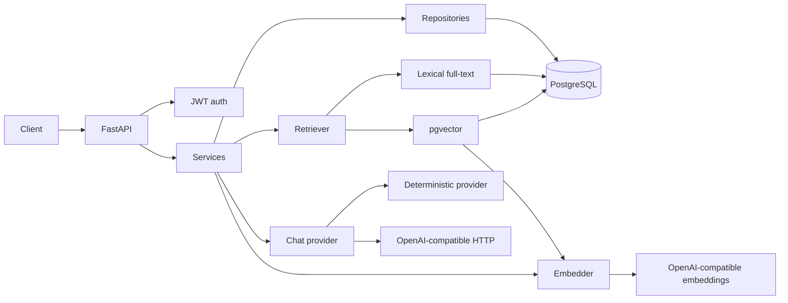

# Production AI SaaS Backend

Multi-tenant knowledge assistant API. An organization registers, stores plain-text documents in knowledge bases, and asks questions. The API retrieves passages from PostgreSQL and returns an answer grounded in those passages, with conversation history.

With no model key configured, a deterministic provider answers from the retrieved passages. The same application code can send that context to any OpenAI-compatible chat endpoint. Lexical search is the default and does not require an embedding provider.

## Architecture



A question follows a fixed path:

1. Reject a missing or invalid access token.
2. Load the knowledge base and, when supplied, the conversation inside the caller's organization. Another organization's id is a 404.
3. Retrieve passages with the configured retriever. The current question is the query. Prior messages are not used for retrieval.
4. Send those passages and up to six prior messages to the active chat provider.
5. Store the user message and the assistant message in one transaction.
6. Return the answer, the provider name, the retrieval mode, and the citations.

Citations are the passages the retriever returned. The model is not asked to emit them and cannot add to that list.

Routes validate HTTP and map responses. Services own the rules. Repositories own queries. `app/ai` owns chunking, retrieval, and providers. There is no LangChain or LlamaIndex.

SQLAlchemy and the provider HTTP calls are synchronous. FastAPI runs the endpoints in a threadpool. Async I/O is a later change, not a requirement for the boundaries above.

## Stack

| Piece | Choice |
|---|---|
| API | FastAPI, Pydantic v2 |
| Database | PostgreSQL 16, SQLAlchemy 2, Alembic, psycopg 3 |
| Search | `tsvector` / `ts_rank_cd`, optional pgvector HNSW |
| Auth | Argon2 password hashes, HS256 JWTs |
| Providers | Deterministic local provider, OpenAI-compatible HTTP |
| Runtime | Python 3.12, Docker Compose, GitHub Actions, Ruff, pytest |

## Project structure

```text
app/
  main.py                 application factory and error handlers
  api/                    routes and request dependencies
  core/                   settings, security, logging, domain errors
  db/                     models, session, full-text and vector schema
  schemas/                request and response models
  repositories/           tenant-scoped queries
  services/               business rules
  ai/                     chunking, providers, retrievers
alembic/                  migrations
tests/unit/               no database
tests/integration/        PostgreSQL
```

## Retrieval and providers

`RETRIEVAL_MODE` is either `lexical` (the default) or `vector`. The presence of an API key does not change the mode. A failed embedding call does not fall back to lexical search, and lexical search does not start embedding documents because a key happens to be set.

### Chat

- Empty `LLM_API_KEY`: `DeterministicGroundedProvider`. It quotes the retrieved titles and excerpts. If retrieval returns nothing, it says the knowledge base does not contain an answer. The output does not depend on the network.
- Set `LLM_API_KEY`: `OpenAICompatibleChatProvider` posts to `{LLM_BASE_URL}/chat/completions`. The base URL is the API root, without `/chat/completions`. The model name comes from `LLM_MODEL`. The system prompt tells the model to use only the supplied passages. Timeouts and HTTP failures become HTTP 503. The client does not log the API key.

The external model can still write unsupported prose. This service does not add a second pass that checks the answer against the passages. The citation array remains the retriever's result.

### Lexical retrieval

Chunks are split on blank lines. A paragraph longer than `CHUNK_SIZE` (default 800 characters) is windowed with `CHUNK_OVERLAP` (default 100). Short paragraphs are not packed together.

Each chunk stores a generated `tsvector` using the `simple` configuration, which does not stem and does not assume English. Queries are turned into an OR full-text query through `websearch_to_tsquery`, after the question is split into words. `plainto_tsquery` would require every word, so a normal question that includes "what" would miss a passage that does not contain that word. `ts_rank_cd` still prefers passages that share more of the terms. The caller never sends raw tsquery syntax.

### Vector retrieval and the fixed column width

The embedder port is `embed(texts) -> list[list[float]]`. It has no vendor and no dimension. `OpenAICompatibleEmbedder` posts to `{EMBEDDING_BASE_URL}/embeddings` with the configured model. `EMBEDDING_DIMENSIONS` is optional. It is forwarded only when set, and only because some endpoints accept a `dimensions` field. Leaving it unset keeps the request to `model` and `input`.

PostgreSQL's HNSW index needs a vector width at table-creation time. That width is `SCHEMA_VECTOR_DIMENSIONS` in `app/db/vector_schema.py`. In this schema it is **1536**. Application services do not read that constant. The chunk repository and the vector retriever reject a vector of any other length with HTTP 503 and do not switch retrieval mode. Changing the width means a new migration. This project does not alter the column at runtime.

Documents ingested while the mode was `lexical` have no embeddings. Querying that knowledge base in `vector` mode returns HTTP 409 `embeddings_missing` until the documents are ingested again. It does not silently search with full text.

The test suite injects a fake embedder through the same port. That fake lives under `tests/` and is not a search implementation.

## Configuration

Copy `.env.example` to `.env`. The example contains placeholders only. `.env` is gitignored.

| Variable | Role |
|---|---|
| `ENVIRONMENT` | `development`, `test`, or `production` |
| `DATABASE_URL` | `postgresql+psycopg://...` |
| `JWT_SECRET` | HMAC secret. Production requires 32+ characters and rejects the example value |
| `JWT_EXPIRE_MINUTES` | Access-token lifetime, default 30 |
| `LLM_BASE_URL`, `LLM_API_KEY`, `LLM_MODEL` | Chat provider. An empty key selects the deterministic provider |
| `LLM_TIMEOUT_SECONDS` | HTTP timeout for chat and embeddings, default 30 |
| `RETRIEVAL_MODE` | `lexical` or `vector` |
| `EMBEDDING_BASE_URL`, `EMBEDDING_API_KEY`, `EMBEDDING_MODEL` | Required together when vector mode is on, or when a key is set |
| `EMBEDDING_DIMENSIONS` | Optional request field. Does not change the column |
| `RETRIEVAL_LIMIT` | Passages per question, default 5, maximum 20 |
| `CHUNK_SIZE`, `CHUNK_OVERLAP` | Ingestion window |
| `MAX_DOCUMENT_CHARS` | Document cap, at most 50000 |
| `LOG_LEVEL` | Standard-library log level |

`ENVIRONMENT=production` refuses to start when `JWT_SECRET` is shorter than 32 characters or is one of the public placeholders in the repository, including the Docker Compose default and the test secret.

## Local setup

Requires Python 3.12 and Docker.

```bash
py -3.12 -m venv .venv
```

Windows:

```powershell
.venv\Scripts\Activate.ps1
pip install -e ".[dev]"
docker compose up -d db
copy .env.example .env
alembic upgrade head
python -m app
```

macOS or Linux:

```bash
source .venv/bin/activate
pip install -e ".[dev]"
docker compose up -d db
cp .env.example .env
alembic upgrade head
python -m app
```

`python -m app` starts uvicorn on `0.0.0.0:8000` with JSON logs and the access log disabled. Request lines come from the application middleware. On Windows, call `curl.exe` rather than `curl`, because PowerShell aliases `curl` to `Invoke-WebRequest`.

Compose publishes PostgreSQL on `127.0.0.1:5432`. The application database is `knowledge`. The first initialization of the data volume also creates `knowledge_test` for pytest. If port 5432 is already in use, stop the other server or change the published port and `DATABASE_URL` together.

## Docker

```bash
docker compose up --build
```

Compose starts PostgreSQL, runs `alembic upgrade head`, then starts the API. The published API port is `127.0.0.1:8000`. The Compose `JWT_SECRET` is the public example. It is accepted only because `ENVIRONMENT=development`. Replace it before exposing the service, and set `ENVIRONMENT=production` so a placeholder secret cannot boot.

The database password in Compose is `postgres`. It is a local default, not a credential to reuse anywhere else.

## API

Base path: `/api/v1`. List responses are `{ "items", "limit", "offset" }`. `limit` defaults to 20 and cannot exceed 100. Domain errors use:

```json
{ "error": { "code": "not_found", "message": "Knowledge base not found" } }
```

Validation errors stay HTTP 422. The response omits the submitted value so a rejected password is not echoed.

### Register, then ask

```bash
curl.exe -s -X POST http://localhost:8000/api/v1/auth/register ^
  -H "Content-Type: application/json" ^
  -d "{\"organization_name\":\"Northwind Studio\",\"email\":\"ada@example.com\",\"password\":\"correct-horse\",\"full_name\":\"Ada Owner\"}"
```

```bash
curl -s -X POST http://localhost:8000/api/v1/auth/register \
  -H "Content-Type: application/json" \
  -d '{"organization_name":"Northwind Studio","email":"ada@example.com","password":"correct-horse","full_name":"Ada Owner"}'
```

The response is `{ "access_token", "token_type": "bearer" }`. Send `Authorization: Bearer <token>`.

```bash
curl -s http://localhost:8000/api/v1/auth/me -H "Authorization: Bearer $TOKEN"

curl -s -X POST http://localhost:8000/api/v1/knowledge-bases \
  -H "Authorization: Bearer $TOKEN" \
  -H "Content-Type: application/json" \
  -d '{"name":"Finance","description":"Internal notes"}'

curl -s -X POST http://localhost:8000/api/v1/knowledge-bases/$KB/documents \
  -H "Authorization: Bearer $TOKEN" \
  -H "Content-Type: application/json" \
  -d '{"title":"Q3 finance note","content":"Quarterly revenue was 10 million in the north region."}'

curl -s -X POST http://localhost:8000/api/v1/knowledge-bases/$KB/queries \
  -H "Authorization: Bearer $TOKEN" \
  -H "Content-Type: application/json" \
  -d '{"question":"What was quarterly revenue?"}'
```

A deterministic answer looks like this:

```json
{
  "conversation_id": "uuid",
  "answer": "Based on the retrieved passages:\n\n[1] Q3 finance note\nQuarterly revenue was 10 million in the north region.",
  "provider": "deterministic",
  "retrieval_mode": "lexical",
  "citations": [
    {
      "chunk_id": "uuid",
      "document_id": "uuid",
      "document_title": "Q3 finance note",
      "excerpt": "Quarterly revenue was 10 million in the north region.",
      "score": 0.1
    }
  ]
}
```

Pass `conversation_id` on the next question to append to that conversation. Omit it to start a new one.

### Endpoints

| Method | Path | Auth |
|---|---|---|
| `GET` | `/health` | no |
| `GET` | `/ready` | no |
| `POST` | `/api/v1/auth/register` | no |
| `POST` | `/api/v1/auth/login` | no |
| `GET` | `/api/v1/auth/me` | yes |
| `GET` | `/api/v1/users` | yes |
| `POST` | `/api/v1/users` | owner |
| `POST` | `/api/v1/knowledge-bases` | yes |
| `GET` | `/api/v1/knowledge-bases` | yes |
| `GET` | `/api/v1/knowledge-bases/{id}` | yes |
| `PATCH` | `/api/v1/knowledge-bases/{id}` | yes |
| `DELETE` | `/api/v1/knowledge-bases/{id}` | yes |
| `POST` | `/api/v1/knowledge-bases/{id}/documents` | yes |
| `GET` | `/api/v1/knowledge-bases/{id}/documents` | yes |
| `GET` | `/api/v1/knowledge-bases/{id}/documents/{document_id}` | yes |
| `DELETE` | `/api/v1/knowledge-bases/{id}/documents/{document_id}` | yes |
| `POST` | `/api/v1/knowledge-bases/{id}/queries` | yes |
| `GET` | `/api/v1/conversations` | yes |
| `GET` | `/api/v1/conversations/{id}` | yes |
| `DELETE` | `/api/v1/conversations/{id}` | yes |

Document list items omit the body. The document GET includes it. An empty string on `description` clears it.

## Authentication

Register creates an organization and an owner user, then returns an access token. Login takes email and password. Email is stored and matched in lowercase. Unknown email and wrong password return the same 401 body.

The token is HS256. Claims are `sub` (user id), `org` (organization id), `iat`, and `exp`. The user loaded from `sub` must belong to `org`. Only the owner can create users. There is no invitation flow and no refresh token. A member of the organization can manage that organization's knowledge bases, documents, and questions. Conversations belong to the user who asked. Another member of the same organization receives 404 for those conversations.

Every tenant-owned query filters on `organization_id`. A resource that is missing and a resource that belongs to someone else both return 404.

## Testing

Integration tests use PostgreSQL, including full-text search and pgvector. They are not skipped when the database is down.

```bash
docker compose up -d db
pytest
ruff check .
ruff format --check .
```

Pytest forces the deterministic chat provider and lexical retrieval for the default client, even if the shell has a model key set. One integration test overrides the embedder with the test fake and checks vector ordering. Provider unit tests mock `httpx` and do not call the network.

GitHub Actions uses Python 3.12, `pgvector/pgvector:pg16`, Ruff, and pytest.

## Security

- Passwords are hashed with Argon2. They are not logged and are stripped from 422 responses.
- Request logs are JSON on stdout: request id, method, path, status, duration. Bodies, passwords, and `Authorization` headers are not logged. Provider failures are logged as a status code, not as the outbound request.
- `.env` is ignored. `.env.example` has empty API keys and a placeholder JWT secret.
- Production startup rejects that placeholder, the Compose default, and the public test secret.
- The local database password and the test JWT secret are in this repository on purpose. They are not production credentials.
- Cross-tenant reads are 404s. Retrieval SQL also filters `organization_id`.

## Design tradeoffs

- Synchronous database and HTTP keep ingestion, transactions, and tests direct. They will not be the right shape at high concurrency.
- Lexical search on `simple` works without a model and without assuming English. English stemming would rank English prose better and would miss some other languages less gracefully. The configuration is one constant in `app/db/search_schema.py`.
- Vector width is fixed at 1536 so the HNSW index can exist. A model that emits another width fails clearly. Supporting every width at runtime would mean dropping the index or rebuilding the column, which this service does not do.
- Retrieval mode is an explicit setting. Inferring it from "is there an API key?" would change behavior when an operator adds a key for later use.
- Access tokens expire in 30 minutes and there is no refresh token. That is a smaller authentication surface.
- Citations are retrieval results. They can be irrelevant. They cannot be invented by the model. Checking that the prose only uses those passages is a separate problem.
- Ingestion is synchronous and limited to 50,000 characters of plain text. There is no file upload, PDF parsing, or worker queue.
- Deleting a knowledge base deletes its documents, chunks, and conversations. The database does that with foreign keys.

## Production extensions

These are not implemented:

- Refresh tokens and a real secret manager
- Object storage and a worker for large files
- Hybrid lexical-plus-vector ranking and a retrieval evaluation set
- Async database I/O
- Rate limiting, OpenTelemetry, and an audit log

## License

No license is granted by this repository until one is added.
